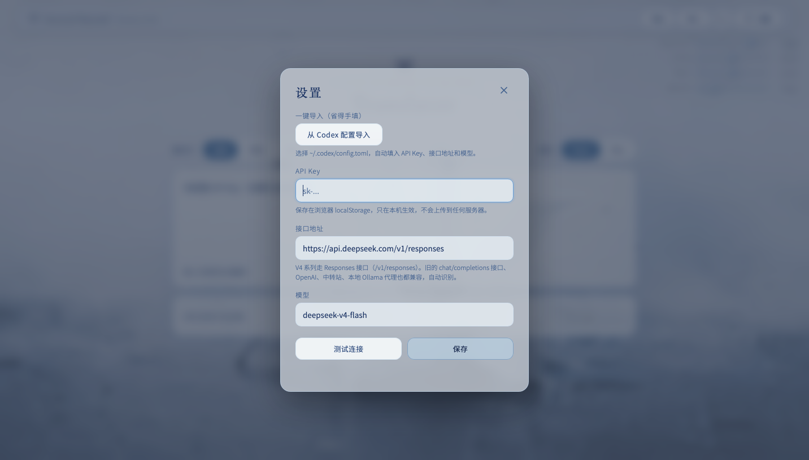
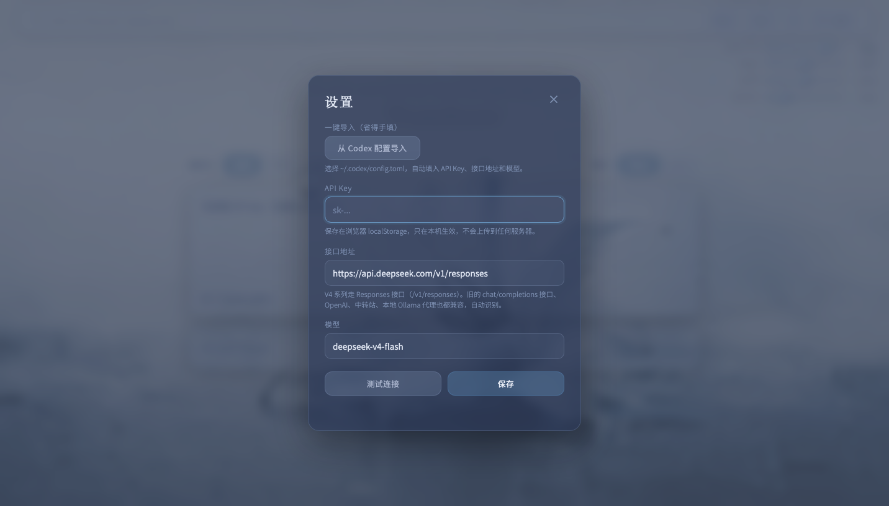
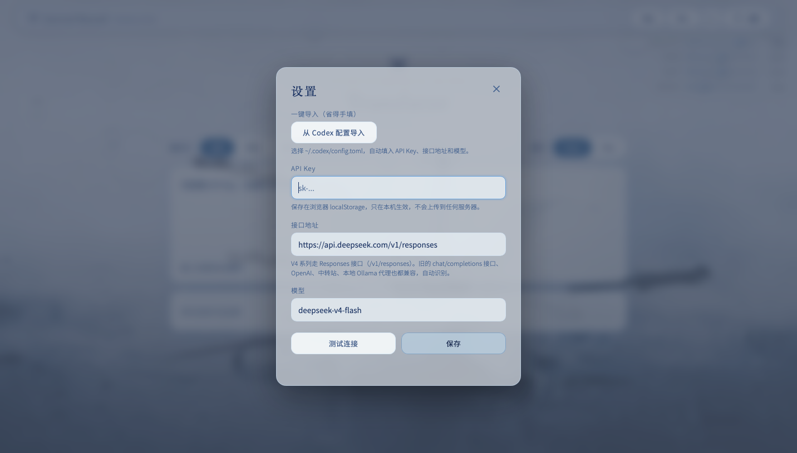

# 便携 AI 翻译器

Author: [Halo](https://github.com/Halo0sama)

一个**单文件、打开即用**的离线网页翻译器。输入文字自动在中文与英文之间互译；界面带有原版 Internal Beyond 风格的深蓝雾气、水面雨波与玻璃擦雾效果。

  
  

  

## 功能

- **打开即用**：单 HTML 文件，无需安装、无需后端，双击即可使用
- **自动翻译**：输入即自动翻译，支持流式输出；中英互译，语言方向可切换
- **水面效果**：雨丝、涟漪、拖拽拨水；右上角 QUALITY / RAIN 温度计调节
- **雾气效果**：整页朦胧雾气，按住拖动即可擦开；MIST 调节浓度，BRUSH 调节笔刷
- **主题切换**：深色 / 浅色，背景与文案跟随 Internal / Infernal 切换
- **通用配置导入**：支持 TOML、JSON、.env、纯文本，自动识别 API Key、接口地址与模型
- **配置导出 / 导入**：换设备一键迁移
- **数据本地**：所有数据只保存在浏览器，不上传任何服务器

## 使用

1. 下载 `index.html`，用浏览器打开。
2. 首次打开会自动弹出设置：选择「从配置文件导入」，或手动填写 API Key / 接口地址 / 模型。
3. 保存后即可直接输入文字翻译，之后每次打开即用。

## 在线使用

https://halo0sama.github.io/ai-translator/

## 致谢与许可

界面视觉与素材改编自 **Sui — Internal Beyond**（[Sui-IB/InternalBeyond](https://github.com/Sui-IB/InternalBeyond)），遵循 **CC BY-NC-SA 4.0**。

- 已保留署名并链接原项目；
- 修改内容：压缩 / 放大背景素材、重构为单文件翻译器、新增水面、雾气、雨量等交互；
- 本仓库整体以 CC BY-NC-SA 4.0 发布，仅限非商业用途；
- 本项目与原项目无关，不构成官方版本，也不暗示原项目作者背书。

完整许可见 [LICENSE](./LICENSE)，素材致谢见 [CREDITS.txt](./CREDITS.txt)。
